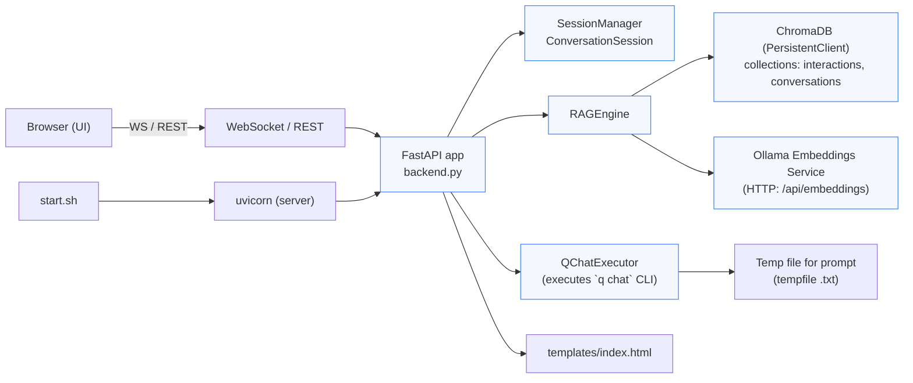
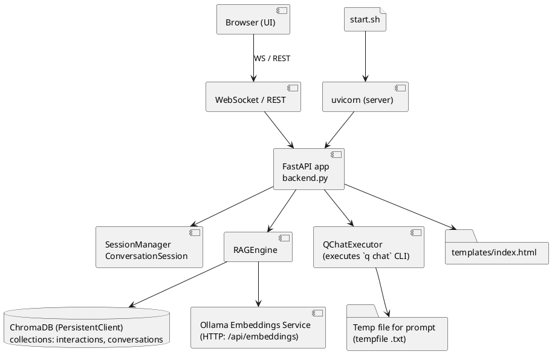

# Q Chat — Web Interface

Lightweight RAG-powered chat web interface built around FastAPI, Ollama embeddings, and ChromaDB.

This repository contains a minimal FastAPI backend (`backend.py`), a simple HTML client (`templates/index.html`), and a helper `start.sh` script that checks prerequisites (like Ollama) and starts the server.

---

## Key features

- RAG (retrieval-augmented generation) pipeline with deduplication and timestamps.
- Uses Ollama for embedding generation (`embeddinggemma` model).
- Stores embeddings and metadata in ChromaDB (collections: `interactions`, `conversations`).
- Exposes a FastAPI app with WebSocket/REST endpoints and serves the static `templates/index.html`.

---

## Quick start (macOS)

1. Ensure system prerequisites:

   - Python 3.10+ (or your project's required Python version).
   - Ollama installed and running: `ollama serve` (listens on `http://localhost:11434`).

2. Pull or ensure the embedding model is available (the `start.sh` script will attempt this):

   - `ollama pull embeddinggemma` (if not already present).

3. Install Python dependencies:

```bash
pip install -r requirements.txt
```

4. Make sure the templates file exists: `templates/index.html`.

5. Start the app via the helper script (recommended):

```bash
./start.sh
```

Or run directly:

```bash
python backend.py
```

By default the server binds to `http://localhost:8000` (see `start.sh`). The script also attempts to open your browser.

Notes:

- `start.sh` checks Ollama availability and pulls the `embeddinggemma` model if missing.
- The app writes and persists embeddings to a local ChromaDB directory (`./qchat_web_memory` by default).

---

## Files and structure

```
backend.py            # FastAPI backend and RAG engine
requirements.txt      # Python dependencies (commented examples provided)
start.sh              # Helper script to check Ollama and start server
templates/index.html  # Minimal frontend
backup/               # backups and older copies
``` 

---

## Architecture (component view)

Mermaid component graph (same view as PlantUML below):



PlantUML component diagram (identical view):



---

## Runtime flow (summary)

1. User types a query in the front-end served from `templates/index.html`.
2. Browser sends the message to the FastAPI app (via WebSocket or REST).
3. FastAPI retrieves/creates a `ConversationSession` (session manager) and asks the `RAGEngine` to search for relevant contexts.
4. `RAGEngine` calls Ollama to compute embeddings for the query and queries ChromaDB for nearest documents.
5. `RAGEngine` deduplicates contexts, formats them (timestamps preserved), and returns them.
6. FastAPI builds a single-line prompt and may call `QChatExecutor` to run the `q chat` CLI (prompt written temporarily to disk).
7. CLI output (raw and cleaned) is returned to FastAPI, stored into Chroma (with embeddings) and appended to the session history.
8. FastAPI streams the response back to the browser along with context and a formatted prompt view.

---

## Configuration notes

- `OLLAMA_URL` and `OLLAMA_MODEL` are defined in `backend.py`. If you run Ollama on a different host/port, update `start.sh` and `backend.py` accordingly.
- `DB_PATH` can be adjusted in `backend.py` to change where Chroma stores data.

---

## Troubleshooting

- If `start.sh` exits with "Ollama is not running", start Ollama with `ollama serve` and retry.
- If `templates/index.html` is missing, copy from `backup/templates/index.html` or create a basic HTML file.
- If dependencies are missing, verify your `pip` uses the correct Python interpreter: `python -m pip install -r requirements.txt`.

---

## Next steps & suggestions

- Add a small `requirements.txt` with pinned versions (currently commented in the repository).
- Add simple unit tests for the prompt builder and context formatter.
- Add a Dockerfile and docker-compose for running Ollama + app in a reproducible environment.

---

Author: KISHORE
Date: 2025-01-06 (source code timestamp)

License: Add your preferred license.
